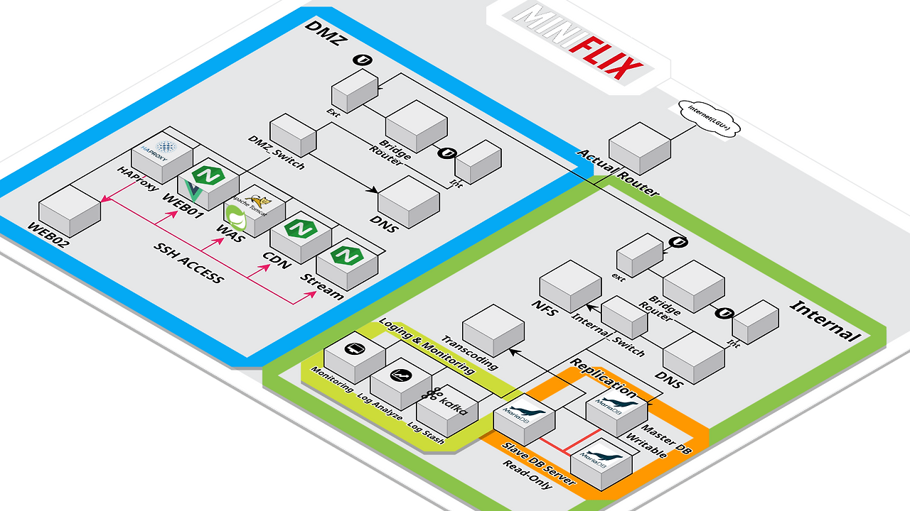

markdown
# 🎬 Miniflix – 온프레미스 기반 미디어 스트리밍 플랫폼

> 하이퍼바이저 환경에서 고가용성 미디어 스트리밍 서비스를 직접 설계 및 구현한 실무형 인프라 프로젝트


## 📌 프로젝트 개요

- **프로젝트 명**: Miniflix – 온프레미스 기반 미디어 스트리밍 플랫폼  
- **개발 기간**: 2025년 4월 24일 ~ 30일 (1주)  
- **팀 구성**: 총 5인 (인프라 중심 팀 프로젝트)  
- **개발 역할**:  
  - DMZ 구간(HAProxy, NGINX, Apache, CDN, 스트리밍 서버) 구성 및 설정  
  - 프론트(Vue.js) / 백엔드(Spring Boot) 풀스택 개발  
- **목표**: 하이퍼바이저 기반 온프레미스 환경에서 고가용성 구조의 스트리밍 플랫폼 직접 구축 및 운영  


## 🧠 기획 배경

- 클라우드 및 컨테이너 환경의 필요성을 체감하기 위해 온프레미스 환경에서 스트리밍 서비스를 직접 구축  
- 실무 환경에서 필요한 **네트워크 구성, 보안 정책, DMZ/내부망 분리, 고가용성 인프라 구성**을 실제로 경험해보기 위함  


## 🛠 인프라 아키텍처



- **하드웨어 구성**: 2대의 물리 PC (DMZ용 / 내부망용)  
- **네트워크 구조**:  
  - 정적 라우팅 + NAT 라우터 구성  
  - DMZ(192.168.1.0/24): HAProxy, NGINX, Apache, CDN, 스트리밍 서버  
  - 내부망(192.168.0.0/24): DB, 파일 서버, 트랜스코딩 서버, 분석 서버  


```
[사용자 요청]
    ↓
[HAProxy] (로드 밸런싱)
    ↓
[NGINX]
 ┌────────────┬──────────────┬
 ↓            ↓              ↓
CDN 서버   스트리밍 서버     Apache(WAS) ───→ MariaDB(Internal_Zone)
```


## 🔧 사용 기술 및 도구

| 분야 | 기술 |
|------|------|
| 하이퍼바이저 | VMware |
| OS | Rocky Linux 8 |
| 네트워크 | NAT, 정적 라우팅, VLAN 유사 구성 |
| Web Server | NGINX, Apache HTTPD |
| LB/Proxy | HAProxy |
| CDN | NGINX 정적 서버 구성 |
| DB | MariaDB |
| 파일 공유 | NFS |
| 스트리밍 | HLS (.m3u8, .ts) |
| 모니터링 | Zabbix |
| 메시지 브로커 | Kafka, Zookeeper |
| 프론트엔드 | Vue.js |
| 백엔드 | Spring Boot |


## 💻 담당 업무 상세

## 박수빈
### DMZ 구간 구성
- HAProxy로 요청 분산 및 프록시 전달
- NGINX에서 `/cdn/`, `/stream/`, `/api/` 경로 분기 처리
- Apache WAS와 연동하여 Vue 정적 파일 및 API 서버 대응
- CDN 서버에서 썸네일 및 정적 리소스 제공

### 스트리밍 및 파일 서버 구성
- .mp4 → .m3u8 변환 스트리밍 서버 구성
- 내부망에서 MariaDB 및 파일 서버 연동 구성

### 프론트/백엔드 연동 및 통합 테스트
- Vue.js SPA 개발, Spring Boot API 서버 구현
- NGINX-Apache 프록시 연동을 통한 E2E 통신 구성
- 각 서버 간 포트 및 통신 상태 점검, 빌드 배포 수동 진행


## 🎯 프로젝트 결과

- 실제 라우터, DMZ, 내부망을 구분한 **실무형 온프레미스 스트리밍 인프라 완성**
- NAT, 방화벽 설정, 정적 라우팅 등 **네트워크 관리 능력 향상**
- 프록시 서버 및 로드밸런서 설정을 통해 **트래픽 분산 및 응답 속도 최적화**
- **Vue.js + Spring Boot** 풀스택 개발 및 배포까지 경험

🎥 **시연 영상**: [YouTube 링크 바로가기](https://www.youtube.com/watch?v=_oIZswled7s)  
📄 **PPT 발표자료**: [Canva 링크 바로가기](https://sulgasaeng.my.canva.site/miniflix)


## 📚 회고 및 성장

- **하이퍼바이저의 한계 체감**: VM마다 OS 설치 필요 및 리소스 낭비 → 컨테이너 대비 효율 낮음
- **전체 인프라 흐름을 직접 설계하고 운영**한 경험을 통해 인프라의 구성 요소와 역할에 대한 통찰력 향상
- **GitOps 기반 CI/CD, K8s 환경**으로 확장 시 어떤 개선이 가능한지 실무적 관점에서 비교할 수 있는 안목 확보
- **운영 자동화의 필요성 인식**: 반복적인 배포/테스트 과정의 비효율성을 경험 → 차기 프로젝트에서는 자동화 도입 예정


## 📎 관련 링크

- [📽️ 시연 영상 (YouTube)](https://www.youtube.com/watch?v=_oIZswled7s)
- [🖥️ 발표자료 (Canva)](https://sulgasaeng.my.canva.site/miniflix)

